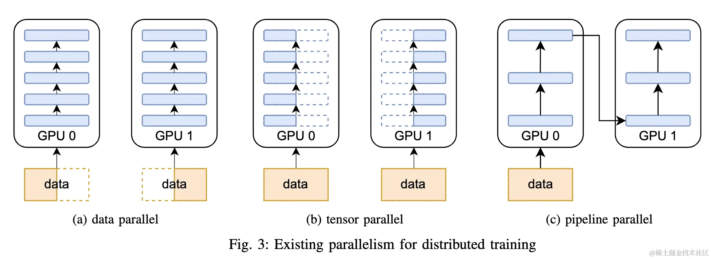

# 背景介绍
## 问题与动机：为什么要并行训练？
随着 Transformer 和 Mixture‑of‑Experts 等模型的**参数规模**直逼甚至超过百亿甚至万亿级，**单张 GPU 的显存和算力已经难以承载完整模型和足够大的批量**。这促使业界探索**分布式并行训练**，通过将模型权重、梯度或计算过程拆分到多个设备来提高资源利用率。
本节按照从基础到应用的层次对主流并行技术进行梳理，重点介绍我们实验中采用的数据并行优化 ZeRO、两种流水线调度策略 GPipe 与 1F1B，以及它们的混合组合。
**参数爆炸**：随着 Transformer 和 Mixture‑of‑Experts 等模型的**参数规模**直逼甚至超过百亿甚至万亿级，**单张 GPU 的显存和算力已经难以承载完整模型和足够大的批量**
**训练目标**：提高资源利用率和训练效率
**通信挑战**：跨机 RDMA 带宽有限、拥塞会放大 *pipeline bubble*
**引出本工作**：聚焦 **RDMA 网络中的通信调度** 对训练吞吐的影响

## 主流并行技术：数据并行、张量并行和流水线并行

| 维度            | 拆分对象     | 典型通信                 | 备注                                                      |
| --------------- | ------------ | ------------------------ | --------------------------------------------------------- |
| 数据并行 (DP)   | 样本 / batch | **梯度同步** All-Reduce  | 本项目：**组间**采用，后面重点分析                        |
| 张量并行 (TP)   | 张量维度     | 层内 All-Reduce / Gather | **只做概念介绍**；后续实验关注 RDMA 调度，**TP 细节略过** |
| 流水线并行 (PP) | 网络层序列   | **正向 / 反向传递**      | 本项目：**组内**采用 GPipe 或 1F1B                        |
**张量并行（Tensor Parallelism，TP）** 将某些张量（例如权重矩阵）沿特定维度切分成N份，每个设备只存储其中的一部分。在矩阵乘法等算子中，各设备分别计算自己持有的子矩阵与输入的乘积，然后通过 **All‑Gather** 拼接得到完整结果，从而保持计算正确性。张量并行通常用于模型内部的线性层或注意力计算，可减少单卡显存，但需要高频的层内通信。由于本文聚焦 RDMA 通信调度，**我们仅简要介绍其原理**。

## 数据并行

**数据并行（Data Parallelism，DP）** 是当前最常见的分布式训练形式。它将训练数据划分成多个子批次，每个 GPU 持有完整的模型副本并在自己的数据子集上独立执行前向和反向计算。反向阶段结束后，各 GPU 通过 **All‑Reduce** 操作汇聚梯度并更新模型，以保持参数一致性。

这种方法实现简单，但每个设备需要保存全部模型权重、梯度和优化器状态，显存消耗随模型规模线性增长。
**经典 DP**：复制完整模型 → 反向阶段做梯度 All-Reduce
**痛点**：显存消耗大、GPU、通信量大

## 深入：ZeRO-2 DP
经典数据并行需要在每个设备上保存完整的模型、梯度和优化器状态，显存与设备数呈线性关系。**ZeRO（Zero Redundancy Optimizer）** 是 DeepSpeed 提出的优化技术，它将这些训练状态切片存放到不同 GPU，并通过分层设计逐步减少冗余。
在 **ZeRO‑2** 阶段，优化器状态和梯度都被划分到多个进程，仅存储与本地参数相关的部分。这样可在不改变模型代码的情况下实现较大显存降幅，并将梯度同步过程拆分成多次分桶式 **Reduce‑Scatter / All‑Gather**，从而与计算重叠，提高资源利用率。
在调研后，选择**每累积两个micro-batch的反向计算产生的梯度，就进行一次梯度同步**，这样既能保证显存维持在较低水平，又能使**梯度同步Reduce**与**反向计算**尽可能并行进行，通过重叠**通信行为与计算行为**，提高资源的利用率和训练效率。
**通信特点**：在反向计算中分桶同步，**可与计算重叠**

## 流水线并行
**流水线并行（Pipeline Parallelism，PP）** 将模型的层序列划分为多个阶段，每个阶段部署在不同 GPU 上。在前向传播时，每个设备将中间激活值传递给下一阶段；反向传播时，各阶段将梯度传回上一阶段。这允许不同阶段的前向和反向计算同时进行，但由于相邻阶段必须等待彼此结果，流水线中不可避免地存在 **bubble**（气泡）时间。

通过合理分配 micro‑batch 数和调度顺序，可在一定程度上减少 bubble 并提高利用率。

### GPipe流水线并行
传统的“pipline”形式的训练，由于bubble占比较大，导致训练效率较低。

流水线并行可以采用不同的调度策略来编排各 micro‑batch 的前向和反向顺序。**GPipe** 提出了一种 **F‑then‑B**（先前向后反向）的调度：先**将一个 mini‑batch 分成多个 micro‑batch**，然后沿流水线依次完成所有 micro‑batch 的前向计算，待最后一个 micro‑batch 到达末端后再统一回传梯度。
为了减少 pipeline bubble，GPipe 通过 micro‑batch 切分让多个 micro‑batch 在不同阶段并行推进；前向完成后，所有梯度在反向阶段累加再用于参数更新。

这种策略简单但反向阶段前各层必须等待所有前向完成，导致 pipeline flush 时间较长。
**层切分 + 多 micro-batch**
执行顺序：前向全部完成 → 统一反向
场景：网络深 / 显存不足但带宽压力相对可控

### 1F1B流水线调度

**1F1B**（One‑Forward‑One‑Backward）则采用交替策略：仍然按层划分模型并将 mini‑batch 切分为 micro‑batch，但不同于 GPipe 先完成所有前向再回传，1F1B 在流水线填满后，按 **“前向计算一个 micro‑batch→反向计算一个 micro‑batch”** 的顺序交替执行。
这种调度需要一个 **warm‑up 阶段填满流水线**和一个 **tear‑down 阶段完成最后几个反向**，但整体能够**让梯度更早回传**。
由于**上游正向与下游反向可以长期并发，1F1B 对网络带宽调度更敏感**，是我们实验重点关注的方案。
**One-Forward-One-Backward** 交替链
**双向流量长期并发**：下游前向 (↓) + 上游反向 (↑)
对 RDMA 带宽调度更敏感 → 为何是你实验的重点

## 混合并行架构：组间ZeRO+组内流水线
在大规模模型训练中，仅使用单一并行策略难以兼顾显存、通信和扩展效率。这时候就需要采用 **混合并行** 布局。
### DP+PP混合并行示例

这里重要的是要了解 DP rank 0 是看不见 GPU2 的， 同理，DP rank 1 是看不到 GPU3 的。对于 DP 而言，只有 GPU 0 和 1，并向它们供给数据。GPU0 使用 PP 将它的一些负载转移到 GPU2。同样地， GPU1 也会将它的一些负载转移到 GPU3 。
由于每个维度至少需要 2 个 GPU；因此，这个例子中，至少需要 4 个 GPU：

### ZeRO-DP+PP+TP
为了更高效地训练，可以将 PP、TP 和 DP 相结合，被业界称为 3D 并行，如下图所示。

我们使用的数据并行是ZeRO-DP，它与PP和TP的结合方式如图

我们的具体混合并行设置：
**组间使用 ZeRO‑2 数据并行**。所有 GPU 按组划分，每组内部流水线并行，每个组之间通过 ZeRO‑2 切片并同步梯度，实现显存节约和跨组同步。
**组内使用流水线并行（GPipe 或 1F1B）**。每组包含 4 张 GPU，模型按层划分为 4 个阶段，训练的一个 batch 被切分成 8 个 micro‑batch，在组内流动。
**两种组合**：第一种是 **GPipe + ZeRO‑2**，即组内采用 F‑then‑B 调度；第二种是 **1F1B + ZeRO‑2**，即组内采用交替调度。两种组合的区别仅在于组内 micro‑batch 的前向/反向时序安排不同，前者先完成全部正向再统一反向，后者在流水线填满后正反交替。
在混合并行中，每个阶段存在三类通信流：向下游传递激活的 **正向传递（fwd_prop）**，向上游传递梯度的 **梯度传递（bwd_prop，或反向传递）**，以及跨组的 **梯度同步（grad_sync）**。
**组间**：ZeRO-2 数据并行
**组内**：4 GPU 流水线并行
**Batch 切分**：1 batch → 8 micro-batch
两种排布：

1.  **GPipe + ZeRO-2** (F-then-B)
2.  **1F1B + ZeRO-2** (1F1B)
**三类通信流**：`fwd_prop` ↓、`bwd_prop` ↑、`grad_sync` ↺
# 任务完成情况
## 任务1.1：理想场景下的流水线并行模拟
在理想场景下，我们假设各 GPU 之间的三类通信（**前向激活传递**、**反向梯度传递**与**梯度同步**）各自占用独立的通道，并且梯度同步不会影响计算速度。这意味着只要依赖关系满足，计算与通信可以并行进行，资源不存在相互挤占。在此基础上，我们对比了两种流水线调度策略：**GPipe F‑then‑B**（先完成所有 micro‑batch 的正向，再统一执行反向）和 **1F1B**（正反交替）。
### GPipe F‑then‑B 理想场景
GPipe 的基本思想是在流水线填满后先执行完所有 micro‑batch 的正向计算，然后统一进行所有反向计算。图中横轴为时间、纵轴为各 GPU 的四个通道（自下而上依次为前向传递、计算、梯度同步、梯度传递）。不同颜色代表不同类型任务。可以看到，各 GPU 先利用前向传递与计算通道连续完成 8 个 micro‑batch 的正向阶段（蓝色和浅蓝色）；当所有正向结束后，反向计算（绿色）、梯度传递（紫色）和梯度同步（黄色）才一起发生

### 1F1B 理想场景
1F1B 策略强调填充流水线后正向与反向交替进行。顶层 GPU 先串行完成 4 个 micro‑batch 的正向计算，随后与反向任务交替执行：每当收到下游传来的梯度，就立即进行对应 micro‑batch 的反向计算，完成后继续下一个正向；底层 GPU 则在每次正向计算结束后立即执行对应反向。中间层 GPU 的正向和反向顺序由收到的通信自然驱动。理想场景下的可视化如图所示，可以看到正向和反向任务交错进行。
{:height 485, :width 750}

### 1.1小结
在不考虑通信的场景中，**1F1B** 通过交替正向和反向计算，减少了pipline bubble的空闲时间，使得梯度更早回传，是一种提高资源利用效率的方法。

但在加入gpu之间的通信行为（正向传递、反向传递）后，发现： 由于通信行为造成的延时，因而无法正常进行原来预想的“one forward one backward”的行为，导致**最终完成时间要高于GPipe**。因此在实际系统中，可能需要进一步考虑它的优化。

## 任务1.2:资源争用场景下的流水线并行模拟
在现实系统中，前向激活传递、反向梯度传递与梯度同步往往共享同一条物理链路，无法做到“各走各道”。当多种通信行为同时发生时，它们需要竞争有限的带宽，影响彼此的完成顺序和训练效率。本节在 1.1 的模拟基础上，进一步考虑 **通信资源争用**，仍然分 GPipe 和 1F1B 两种调度策略。
### 资源争用下的GPipe调度
我们使用**单通道**的形式，来代表有限的通信资源（也就是发送带宽）。在单通道版本中，每个 GPU 只有一个计算通道和一个通信通道，三类通信任务使用相同的带宽，权重设为 **1:1:1**。
单通道 F‑then‑B 调度的时间线，如下图所示。蓝色条纹区代表前向激活传递，绿色为反向计算，紫色为梯度传递，黄色为梯度同步。可以看到，当正向任务完成后，多种通信行为在遇到并行情况时，开始密集竞争同一通道，在时间轴中形成明显的拥堵带。

#### 网络流量可视化
为分析通信拥塞，我们需要记录通信链路在不同时间段的带宽使用情况。通过读取调度函数输出的列表（**每个任务的开始时间、结束时间、占用带宽份额和类型**），可统计每一小时间片内各通信类型的带宽占用并求和。
我们编写了脚本，计算出 GPipe 单通道场景下通信链路的瞬时带宽使用，并绘制折线图。
其中黑色折线为所有通信的总带宽占用，彩色折线分别表示正向传递、梯度传递和梯度同步的占用。
图中 Y 轴为聚合后的带宽占比（单位带宽=1，四个 GPU 的峰值为 4），X 轴为时间。

可以看到前向阶段通信较集中，而反向阶段梯度同步占用了大量带宽，总体峰值达到 4

### 资源争用下的1F1B调度
1F1B 策略在资源争用场景下与 GPipe 有显著不同。
由于在反向计算的过程中同时穿插正向计算，正向计算结束后产生的 **正向传递** 通信可能与反向梯度传递和梯度同步同时占用同一条链路。
这意味着**在管道“回传”阶段，不仅梯度传递和梯度同步会争用通信通道，正向传递也会时不时参与竞争，使得通信资源争用更加显著。**单通道 1F1B 调度的时间线，如下图所示

#### 网络流量可视化
同样地，我们统计不同时间段内三类通信任务占用通信通道的带宽份额，并绘制折线图。
黑色折线代表通信总带宽占用，其他颜色分别表示正向激活传递、梯度传递和梯度同步。
与 GPipe 相比，1F1B 的总带宽曲线波动更频繁，蓝色的激活传递在反向阶段也会时不时出现，表明正向计算与反向计算并行发生时对通信链路的竞争更加激烈

### 1.2小结
与理想场景相比，考虑到有限带宽资源争用的单通道场景，各种通信行为的时间被拉长，依赖上游/下游传来通信才能开始的计算行为也被相应延后，这不仅增加了梯度返回的延迟，也使得 GPU 在等待梯度同步时大量空闲。
网络流量曲线显示，反向阶段梯度同步的带宽占用远高于激活传递和梯度传递，表明梯度同步可能是主要的通信瓶颈。实际系统中可以考虑采用压缩梯度、分层同步，或调节各种通信资源权重等方式，缓解这一瓶颈。
在单通道 1F1B 场景下，由于正向和反向计算交织进行，正向激活传递经常在梯度传递和梯度同步过程中插入，这导致通信峰值出现得更频繁。虽然 1F1B 原本预想情况下能让梯度更早回传，但其通信链路压力更为复杂，需要合理的调度技术来提高效率。
## 任务1.3:接收端拥塞场景与优先级优化方法
在 1.2 的基础上，本节从两个方面深入分析通信瓶颈对训练性能的影响，并提出一种可行的优化思路——**主动调整通信任务优先级**。我们首先介绍**接收端拥塞控制**在 1F1B 与 GPipe 中的差异，然后通过遍历不同优先级组合定量评估其对训练总时间和其他指标的影响，最终选出性能最佳的方案。
### 接收端拥塞场景
#### 1F1B 场景
如前所述，1F1B 中正向和反向计算交替进行，底层 GPU 在完成正向计算后立即回传梯度，上层 GPU 则在完成部分反向计算后再继续下一个正向。
这使得在某些时刻，上游的 **正向传递** 与下游的 **反向传递** 会同时流入同一 GPU 的接收端，导致传入带宽超过通道容量。

为了避免下游 GPU 被上游流量挤压，我们引入了 **接收端拥塞控制**：当某个 GPU 的接收端带宽之和超过 1 时，**按比例缩减**上行和下行通信任务的带宽份额，使其总和不超过通道限额。
对比有无接收端拥塞控制的甘特图可看出，考虑到接收端带宽能力限制后，实际的系统训练完成时间有所延后。

GPipe 采用 F‑then‑B 调度，所有正向计算在流水线填满后一次完成，随后统一进行反向计算。正向阶段只有激活传递，反向阶段只有梯度传递和梯度同步，同一时刻传输方向单一。因此不存在上游和下游同时向某一 GPU 写入的情况，因此**不会**出现在同一时刻，接收端接收通信超过能力限制的情形。

### 优先级扫描与性能可视化
为定量评估不同通信任务优先级对训练时间的影响，我们编写了脚本，通过读取预先配置中的环境参数（如 micro‑batch 数量、前向/反向/传递时长、同步频率、同步对计算的算力影响），遍历三类通信任务的权重组合并调用相应的模拟器进行仿真。
脚本会输出每个场景的总训练时间，绘制 **完成时间-优先级组合** 的热力图。下面给出 GPipe 和 1F1B 单通道场景的热力图示例。展示的是在上述配置下，GPipe 和 1F1B 单通道场景扫描步长为 0.1 的完成时间热力图：
**1F1B:**

**GPipe:**

热力图横轴为 `p_grad_prop`（反向梯度传递的共享权重），纵轴为 `p_fwd_prop`（前向激活传递的共享权重），另一种通信任务 `p_grad_sync` 的权重由上两者决定。当某个任务被指定为独占（标记为 `a`）时，其它共享任务的权重和为 0。颜色表示仿真的总训练时间，数值越小表示性能越好。可以看到：
在两种调度策略下，总时间较短的区域仍集中在右侧，即 正向传递和梯度传递之和=1，也就是梯度同步优先级为0 的场景。越往左下角，也就是**梯度同步**优先级越大，总时间越长，对应性能也就越差。
对于 1F1B，最优结果出现在 `p_fwd_prop=a`、`p_grad_prop=1.0` 的组合（完成时间约 53.46），意味着将梯度传递完全独占，正向传递次级独占，梯度同步最后进行，能最大限度减少交织带来的拥塞。
此时的甘特图展示如下：

对于 GPipe，最优区域是一条斜线，`p_grad_prop` 较大（0.6–1.0），且正向传递和梯度传递之和=1时完成时间最短，说明优先保障反向梯度传递，减弱梯度同步优先级，可以让 F‑then‑B 更快完成反向阶段。
选取`p_fwd_prop=a`、`p_grad_prop=1.0` 的组合，甘特图展示如下：

当三种通信任务平均分配带宽或**梯度同步权重较大**时，总训练时间显著上升，这是因为梯度同步占用的带宽最多，会阻塞其它通信，并且由于正向/反向计算依赖于正向/反向传递，因此计算行为也会随之延后，从而进一步降低训练效率。
综上，通过调节通信任务的优先级，我们可以在单通道模型中主动缓解拥塞。对于本次配置（步长 0.1)，两种情况的最佳优先级组合均可以被选为 `p_fwd_prop = a, p_grad_prop = 1.0, p_grad_sync = 0.0`；。这些组合均强调**梯度传递的高优先级**以及**梯度同步的低优先级**，有利于迅速完成反向更新。

### 指标扩展与性能验证
为了全面衡量优化效果，我们计算了多项指标：
**总训练时间**：所有任务完成的最后时间；
**计算/通信时间占比**：正向和反向计算时长与所有通信任务时长之比；
**平均通信吞吐量**：在单通道模型中，单位时间内通信链路的平均带宽占用；
**平均通信延迟**：每个通信任务持续时间的平均值；
**计算资源利用率**：所有计算任务运行时间之和除以可用计算资源（GPU 数 × 总时间）；
**通信资源利用率**：所有通信任务占用带宽与持续时间的乘积，除以通信资源总量（GPU 数 × 总时间）。
下面给出了每个指标随优先级组合变化的热力图（纵轴为 `p_fwd_prop`，横轴为 `p_grad_prop`），分别对应 1F1B 和 GPipe 场景：

#### 计算/通信时间占比
**1F1B：**

**GPipe：**

从上图可以看到，计算时间占比在 1F1B 下总体低于 GPipe（约 46% vs 48%)，因为 1F1B 在反向阶段持续进行通信，导致通信开销更大。当 `p_grad_prop` 较高时，计算占比略有提升，说明提前完成梯度传递可以减少等待时间。

#### 平均通信吞吐量
**1F1B：**

**GPipe：**

平均通信吞吐量反映了链路利用率。1F1B 的吞吐量整体上略低于 GPipe，这是由于1F1B在考虑到通信行为后，带宽的空闲率反而比GPipe更高了。另外可以看到，越往左下角，也就是**梯度同步**优先级越大，吞吐量就越小，对应的性能也就越差，这与**完成时间**的表现一致。

#### 平均通信延迟
**1F1B：**

**GPipe：**

平均通信延迟对应单次通信的持续时间。延迟在**梯度同步**权重较大时（左下角)明显升高，尤其是 1F1B 场景；优先保障梯度传递可将平均延迟压缩至约 0.48–0.50 时间单位。

#### 计算资源利用率
**1F1B：**

**GPipe：**

计算资源利用率衡量 GPU 忙碌程度。GPipe 在优先梯度传递时可达到约 55%，1F1B 的利用率相对较低，因为正向/反向交替导致更多空闲，最佳组合下约 47%。
从这些指标热力图可以看出：
**总训练时间**、**平均延迟** 和 **通信占比** 随梯度同步权重增大而显著上升，因此建议减小 `p_grad_sync` 并提高梯度传递或前向传递权重；
**吞吐量**、**计算占比** 和 **利用率** 在优先梯度传递的区域达到最大，表明高优先级有助于提升链路利用效率；
**1F1B** 场景由于通信方向交织，其指标曲面波动更大，并且整体性能略逊于 **GPipe**，但通过调节优先级仍然可以逼近最佳水平。
综合来看，**在我们的环境配置下**，最优方案是在 **1F1B** 中将梯度传递完全独占，而在 **GPipe** 中给予梯度传递较高的共享权重，并且两种情况下，都将梯度同步的优先级尽可能降低，最优的方法是设为0。这一策略不仅缩短了总训练时间，也提升了计算和通信资源的利用率。

### 总结
任务 1.3 通过在 1F1B 单通道场景中引入接收端拥塞控制，并扫描不同通信优先级组合，对比了 GPipe 和 1F1B 在网络拥塞下的表现。实验表明：
1F1B 场景由于正向和反向交织，接收端可能同时处理来自上下游的通信，需要拥塞控制以保证不超出接收方的承受能力；GPipe 则无需该机制。
调节通信任务的优先级是一种有效的优化手段。**优先保障梯度传递或前向传递，降低梯度同步优先级**可显著缩短总训练时间，并提高计算/通信资源利用率。
使用多项指标验证了这一点：在最优策略下，通信延迟和吞吐量都得到了改善，计算和通信的负载更加平衡。
这些分析为后续阶段（例如进一步研究延迟抖动、异构网络等）打下了坚实基础，也为实际系统设计提供了有价值的调度优化思路。

# 总结与讨论